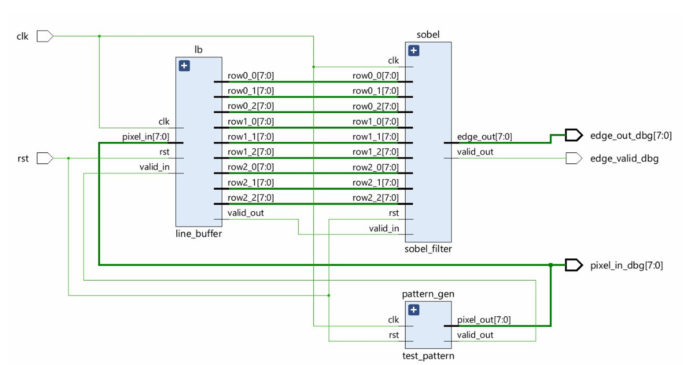
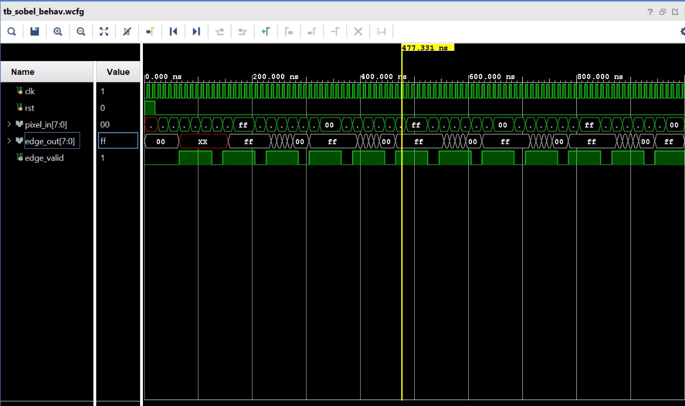

# FPGA Sobel Edge Detection – Verilog (Simulation Project)

This repository contains a **Sobel Edge Detection simulation project**
developed during my **2nd year of undergraduate studies** as part of
learning **FPGA-based image processing using Verilog HDL**.

The design is intended for **simulation in Xilinx Vivado** and demonstrates
the complete Sobel pipeline using a test pattern generator.

---

## 🔧 Project Overview
- Serial pixel input
- 3×3 window generation using line buffers
- Sobel Gx and Gy computation
- Edge magnitude calculation
- Saturated 8-bit output

---

## 📁 Modules

| Module | Description |
|------|------------|
| `sobel_filter.v` | Sobel convolution and edge magnitude |
| `line_buffer.v` | 3×3 window generation (educational) |
| `test_pattern.v` | Checkerboard test image |
| `sobel_top_sim.v` | Top module for simulation |
| `tb_sobel.v` | Testbench |

---
## 🧩 Block Diagram

The architecture consists of a test pattern generator, line buffer for 3×3 window generation, and Sobel filter for edge computation.

  

## Simulation Results

Simulation was performed in Vivado using an 8×8 checkerboard input.

The waveform shows edge detection output (`edge_out`) corresponding to 
high-contrast transitions in the checkerboard input pattern.
---

## ⚠️ Notes
- This is a **simulation-only academic project**
- Line buffer is simplified for learning
- Not optimized for large image resolutions

---

## 🧠 Learning Outcomes
- FPGA image processing basics
- Sobel edge detection
- Verilog RTL design
- Simulation and verification

---

## 👤 Author
2nd Year FPGA Simulation Project
